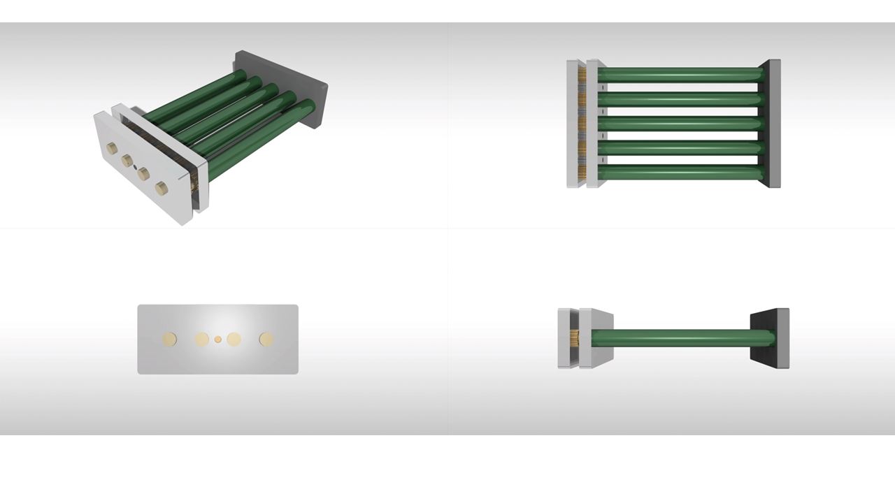

# Smart Egg Incubator Monitoring and Control System

Final project **Mechatronics Engineering Design**

---

## 📌 Project Summary
This project presents a smart egg incubator system designed to automatically monitor and control the environmental conditions required for egg incubation. The system focuses on maintaining stable **temperature** and **humidity**, performing **automatic egg turning**, and notifying the user in case of abnormal conditions using **SMS alerts**.

The goal of the project is to increase incubation reliability, reduce manual intervention, and improve hatch success rates compared to traditional incubator systems.

---

## 🎓 Academic Information
- **University:** Sakarya University of Applied Sciences  
- **Faculty:** Faculty of Technology  
- **Department:** Mechatronics Engineering  
- **Course:** Mechatronics Engineering Design  
- **Student:** Khalil Kanaan  
- **Student ID:** B210104573  
- **Supervisor:** Assoc. Prof. Dr. Serkan Dereli  
- **Date:** January 2026  

---

## ⚙️ System Features
- Real-time temperature monitoring  
- Real-time humidity monitoring  
- Automatic heater control  
- Automatic humidifier control  
- Periodic egg turning mechanism  
- LCD display for local monitoring  
- SMS alert system for critical conditions  
- Fully automatic operation  

---

## 🧩 Hardware Used
- Arduino microcontroller  
- Temperature & humidity sensor (DHT series)  
- Relay modules  
- Heater (lamp / resistive heater)  
- Humidifier unit  
- Egg turning motor  
- 16x2 LCD display  
- GSM module (SMS communication)  

---

## 💻 Software & Tools
- Arduino IDE  
- Embedded C/C++ (Arduino framework)  
- Proteus (circuit simulation)  

---

## 🔄 How the System Works
1. Sensors measure temperature and humidity inside the incubator.
2. The microcontroller evaluates the measured values.
3. Heater and humidifier are controlled automatically.
4. Eggs are turned at predefined time intervals.
5. Current values are displayed on the LCD.
6. SMS alerts are sent when values exceed safe limits.

////////

## 📷 System Overview

### System Block Diagram

### Circuit Schematic

